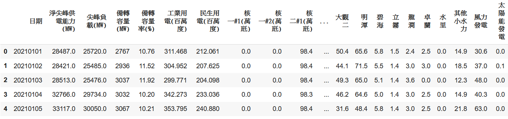
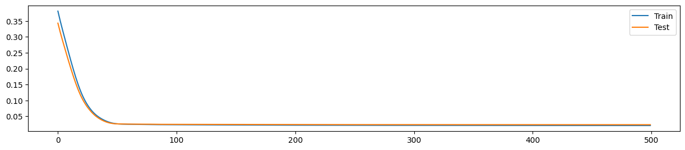
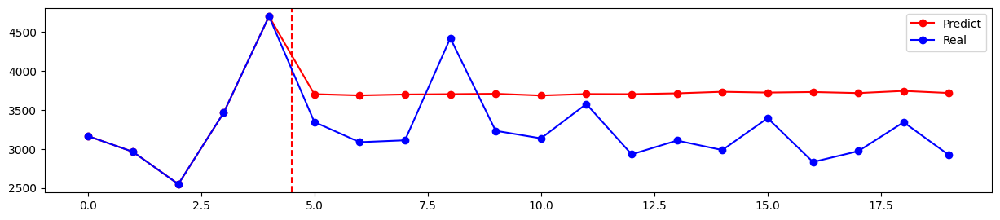
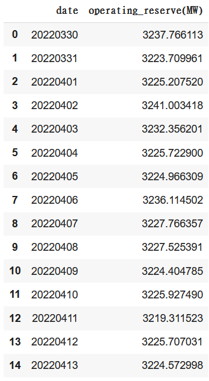
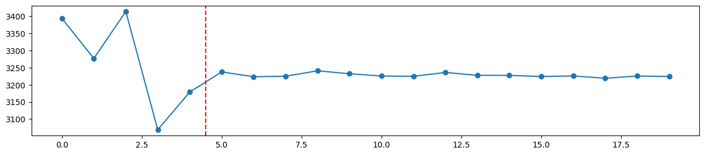

# HW1 Report

## Data Preprocessing

以下是從台電網站所抓取的數據，時間從 2021/01/01 到 2022/03/29。
因為我們所要預測的為備轉容量，故保留該 column 就好，其餘皆可刪除。



以下是 2021/01/01 到 2022/03/29 的數據圖，呈現備轉容量的趨勢。


以下使用 scikit-learn 中的 MinMaxScaler 來標準化數據集，範圍在 0 到 1 之間。

```python
sc = MinMaxScaler()
training_data = sc.fit_transform(training_set)
```

以下函式會將數據集根據訓練天數及欲預測的天數來做切割。

```python
def sliding_windows(data, seq_length, pred_length):
    x = []
    y = []

    for i in range(len(data) - seq_length - 1 - pred_length):
        _x = data[i : (i + seq_length)]
        _y = data[i + seq_length : (i + seq_length + pred_length)]

        x.append(_x)
        y.append(_y.flatten())

    return np.array(x),np.array(y)
```

以下程式碼將數據集分成訓練集及測試集，比例為 2 : 1。

```python
train_size = int(len(y) * 0.67)
test_size = len(y) - train_size

dataX = Variable(torch.Tensor(np.array(x)))
dataY = Variable(torch.Tensor(np.array(y)))

trainX = Variable(torch.Tensor(np.array(x[0:train_size])))
trainY = Variable(torch.Tensor(np.array(y[0:train_size])))

testX = Variable(torch.Tensor(np.array(x[train_size:len(x)])))
testY = Variable(torch.Tensor(np.array(y[train_size:len(y)])))
```

## Model

我所使用的模型為 LSTM，常使用於 Time Series Forecasting，此次的台電備轉容量適合使用此模型。
此模型輸入為一個長度為 5 天的資料集，輸出為長度為 15 天的預測。

```python
class LSTM(nn.Module):

    def __init__(self, num_classes, input_size, hidden_size, num_layers):
        super(LSTM, self).__init__()

        self.num_classes = num_classes
        self.num_layers = num_layers
        self.input_size = input_size
        self.hidden_size = hidden_size
        self.seq_length = seq_length

        self.lstm = nn.LSTM(input_size=input_size, hidden_size=hidden_size,
                            num_layers=num_layers, batch_first=True)

        self.fc = nn.Linear(hidden_size, num_classes)

    def forward(self, x):
        h_0 = Variable(torch.zeros(
            self.num_layers, x.size(0), self.hidden_size))

        c_0 = Variable(torch.zeros(
            self.num_layers, x.size(0), self.hidden_size))

        # Propagate input through LSTM
        ula, (h_out, _) = self.lstm(x, (h_0, c_0))

        h_out = h_out.view(-1, self.hidden_size)

        out = self.fc(h_out)

        return out
```

以下為模型所使用到的參數。
使用 Root Mean Squared Error 作為 loss function，
並使用 Adam Optimizer 作為 Optimizer。

```python
num_epochs = 500
learning_rate = 0.01

input_size = 1
hidden_size = 2
num_layers = 1

num_classes = pred_length

lstm = LSTM(num_classes, input_size, hidden_size, num_layers)

criterion = torch.nn.MSELoss()    # mean-squared error for regression
optimizer = torch.optim.Adam(lstm.parameters(), lr=learning_rate)
```

以下為模型訓練及預測的 loss 所畫成的圖表。
train_loss 約收斂於 0.0211，
test_loss 約收斂於 0.0237。



## Prediction

以下為隨機一組測試集的實際資料及模型預測結果所做出的圖表。
藍色為實際資料，紅色為模型預測結果。
可以看到預測結果會收斂於一個值。



以下為 2022/03/30 ~ 2022/04/13 的預測結果及圖表




