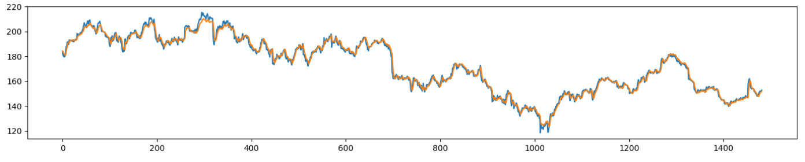

# HW2 Report

## Data Preprocessing

以下是從 training data 所擷取的數據，為 NASDAQ:IBM 約五年的股票數據。
Column 從左而右分別為開盤價、最高價、最低價、收盤價。


以下使用 scikit-learn 中的 MinMaxScaler 來標準化數據集，範圍在 0 到 1 之間。

```python
sc = MinMaxScaler()
open_data = sc.fit_transform(open_set)
```

以下函式會將數據集根據訓練天數及欲預測的天數來做切割，且我只使用開盤價來做訓練。

```python
def sliding_windows(data, seq_length):
    x = []
    y = []

    for i in range(len(data)-seq_length-1):
        _x = data[i:(i+seq_length)]
        _y = data[i+seq_length]
        x.append(_x)
        y.append(_y)

    return np.array(x),np.array(y)
```

## Model

我所使用的模型為 LSTM，常使用於 Time Series Forecasting，此次的股票價格預測適合使用此模型。
此模型輸入為過去 5 天的開盤價，輸出為明天的開盤價預測。

```python
class LSTM(nn.Module):

    def __init__(self, num_classes, input_size, hidden_size, num_layers):
        super(LSTM, self).__init__()

        self.num_classes = num_classes
        self.num_layers = num_layers
        self.input_size = input_size
        self.hidden_size = hidden_size
        self.seq_length = seq_length

        self.lstm = nn.LSTM(input_size=input_size, hidden_size=hidden_size,
                            num_layers=num_layers, batch_first=True)

        self.fc = nn.Linear(hidden_size, num_classes)

    def forward(self, x):
        h_0 = Variable(torch.zeros(
            self.num_layers, x.size(0), self.hidden_size))

        c_0 = Variable(torch.zeros(
            self.num_layers, x.size(0), self.hidden_size))

        # Propagate input through LSTM
        ula, (h_out, _) = self.lstm(x, (h_0, c_0))

        h_out = h_out.view(-1, self.hidden_size)

        out = self.fc(h_out)

        return out
```

以下為模型所使用到的參數。
使用 Root Mean Squared Error 作為 loss function，
並使用 Adam Optimizer 作為 Optimizer。

```python
num_epochs = 500
learning_rate = 0.01

input_size = 1
hidden_size = 2
num_layers = 1

num_classes = pred_length

lstm = LSTM(num_classes, input_size, hidden_size, num_layers)

criterion = torch.nn.MSELoss()    # mean-squared error for regression
optimizer = torch.optim.Adam(lstm.parameters(), lr=learning_rate)
```

以下為模型訓練及預測的 loss 所畫成的圖表。
train_loss 約收斂於 0.0006。


以下為整個 training set 及我的模型所預測出來的價格所畫的圖表，可以看出整個趨勢十分接近(橘色為我的預測，藍色為實際資料)。



## Prediction

接下來將 training set 中最後五天加上 testing set 合併成一個新的資料集，作為最後模型預測的 input。
此 20 日的預測結果出來後，跟前一天做相減，得出是漲還是跌，結果為

```python
['跌', '跌', '跌', '漲', '漲', '跌', '跌', '跌', '跌', '漲', '漲', '漲', '漲', '漲', '漲', '漲', '漲', '跌', '跌']
```

以下為交易程式碼

```python
curr = 0
actions = []

for i in range(0, 19):
  if(trend[i] == '跌'):
    if(curr == 0):
      actions.append(-1)
      curr = -1
    elif(curr == -1):
      actions.append(0)
      curr = -1
    else:
      actions.append(-1)
      curr = 0
  else:
    if(curr == 0):
      actions.append(1)
      curr = 1
    elif(curr == -1):
      actions.append(1)
      curr = 0
    else:
      actions.append(0)
      curr = 1

print('actions', actions)
```

curr 代表現在的持有股數，只能為 -1, 0, 1。

actions 紀錄共 19 天的買賣紀錄。

邏輯很簡單，簡單來說就是見好就收，當預測出來明天會跌的時候，分為以下情況 :

* case 1 (持有股數為 0) :

  執行賣出，做空，等他跌爆再買回來。

* case 2 (持有股數為 -1) :

  甚麼都不做，給他繼續跌。

* case 3 (持有股數為 1) :

  執行賣出，不然未來會跌更慘。

當預測出來明天會漲的時候，分為以下情況 :

* case 1 (持有股數為 0) :

  執行買入，坐等他漲。

* case 2 (持有股數為 -1) :

  趕快買回來，不然會虧。

* case 3 (持有股數為 1) :

  甚麼都不做，等他漲更多。

最後出來的盈餘約為 6.5，至少是正的。
