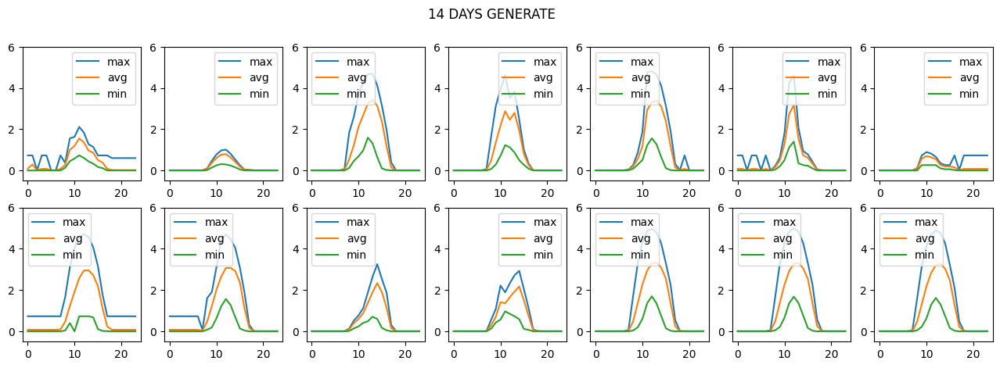
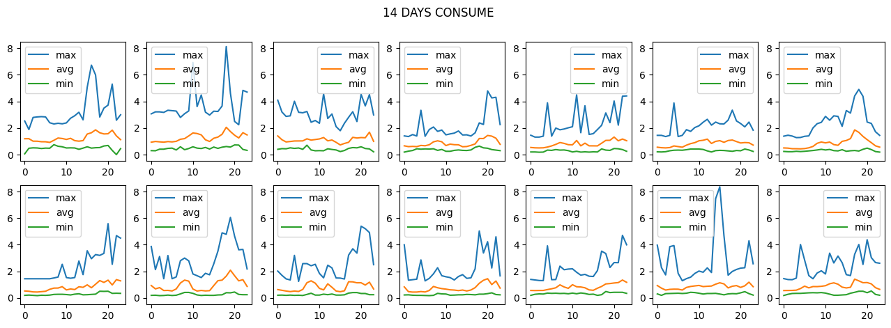
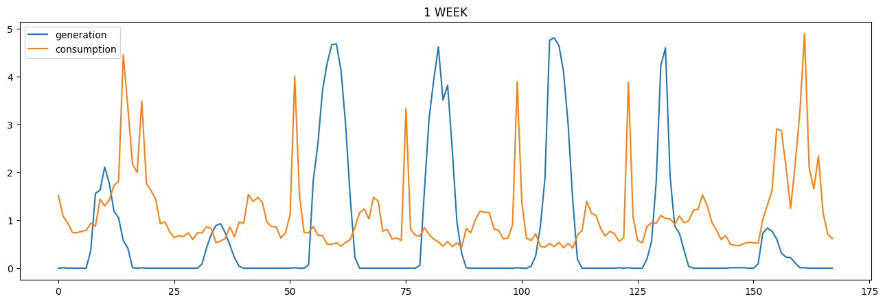

# HW3-Report

## Source

- [Slide](https://docs.google.com/presentation/d/1JW27_5HXYZhqWmgvDhtXBaFTOfksO_dS/edit#slide=id.p1)
- [Dashboard](https://docs.google.com/spreadsheets/d/1cjhQewnXT2IbmYkGXRYNC5PlGRafcbVprCjgSFyDAaU/edit?pli=1#gid=0)

## Rules

- SFTP

```linux
┣━ upload/
┗━ download/
   ┣━ information/
   ┃  ┗━ info-{mid}.csv
   ┣━ student/
   ┃  ┗━ {student_id}/
   ┃     ┣━ bill-{mid}.csv
   ┃     ┗━ bidresult-{mid}.csv
   ┗━ training_data/
      ┗━ target{household}.csv

```

1. `mid` 為每次媒合編號
2. `household` 為住戶編號，共 50 組
3. 請使用發給組長的帳號密碼，將檔案上傳至 `upload/`
4. 相關媒合及投標資訊皆在 `download/` 下可以找到，可自行下載使用

- File

```linux

┗━ {student_id}-{version}.zip
   ┗━ {student_id}-{version}/
      ┣━ Pipfile
      ┣━ Pipfile.lock
      ┣━ main.py
      ┗━ {model_name}.hdf5

```

1. 請務必遵守上述的架構進行上傳 (model 不一定要有)
2. 檔案壓縮請使用 `zip`，套件管理請使用 `pipenv`，python 版本請使用 `3.8`
3. 檔名：{學號}-{版本號}.zip，例：`E11111111-v1.zip`
4. 兩人一組請以組長學號上傳
5. 傳新檔案時請往上加版本號，程式會自動讀取最大版本
6. 請儲存您的模型，不要重新訓練

- Bidding

1. 所有輸入輸出的 csv 皆包含 header
2. 請注意輸入的 `bidresult` 資料初始值為空
3. 輸出時間格式為 `%Y-%m-%d %H:%M:%S` ，請利用三份輸入的 data 自行選一份，往後加一天即為輸出時間
   例如: 輸入 `2018-08-25 00:00:00 ~ 2018-08-31 23:00:00` 的資料，請輸出 `2018-09-01 00:00:00 ~ 2018-09-01 23:00:00` 的資料(一
   次輸出`一天`，每筆單位`一小時`)
4. 程式每次執行只有 `120 秒`，請控制好您的檔案執行時間
5. 每天的交易量限制 `100 筆`，只要有超出會全部交易失敗，請控制輸出數量

## Data Exploring

共 14 天的產電量所繪成之圖表



共 14 天的用電量所繪成之圖表



共 7 天的產用電所繪成之圖表



可以發現此為 timeseries data，對時間非常敏感

## Model

模型採用 LSTM Model

Input: 7 天共 168 小時的產用電資訊

Output: 下一天共 24 小時的產用電資訊

Features: 將原先的 time column 轉換成 year, month, day, hour, weekday columns

## Strategy

透過模型預測出一天 24 小時的生產量及消耗量作相減，
求出每個小時的相差值 `delta`。

若是 `delta` > 0，
代表生產量過多可以執行賣電，
所以這個小時就以 $1 投標，
以提高交易成功率。

若是 `delta` < 0，
代表消耗量過多必須執行買電，
所以這個小時就以 $3 投標，
以提高交易成功率。

我的想法是只要在媒合平台上交易成功，
在沒有買賣超過自己所需的量的情況下，
就一定會省錢，
所以只要你買價夠高或賣價夠低就一定會成功，
因為成交價幾乎都是 2. 多在浮動，
所以買價定 3 賣價定 1 的成功率極高。
